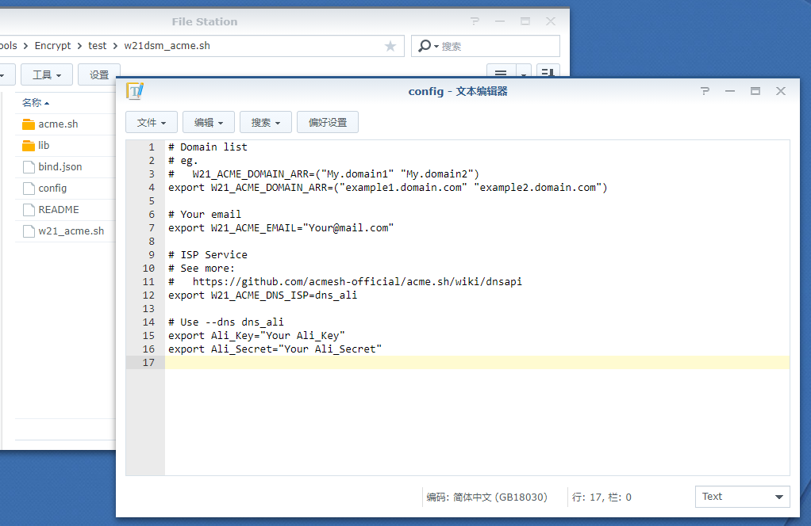
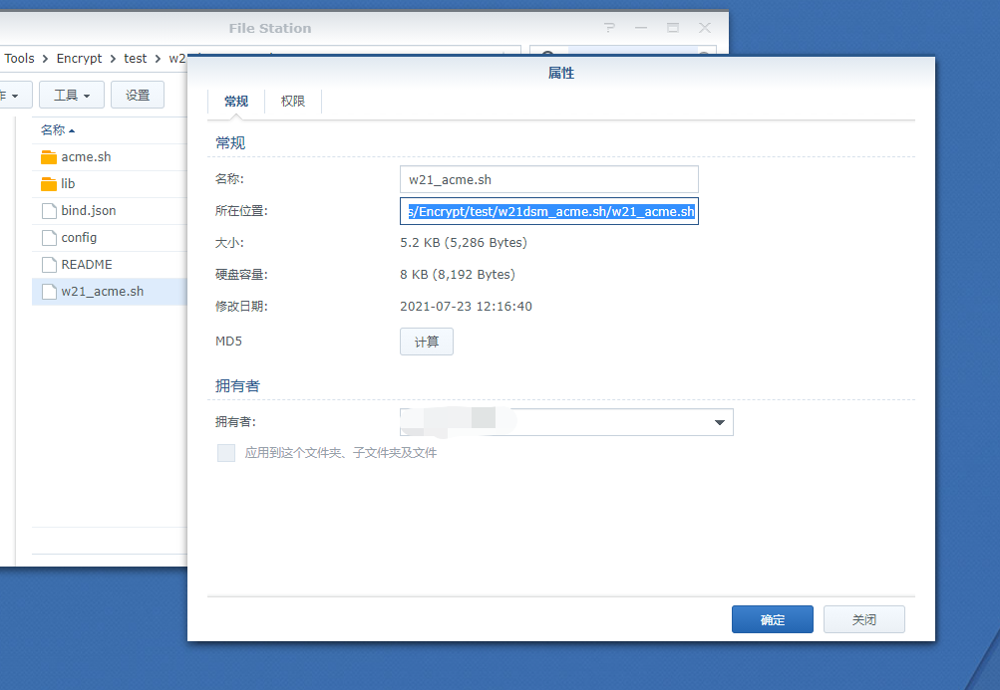
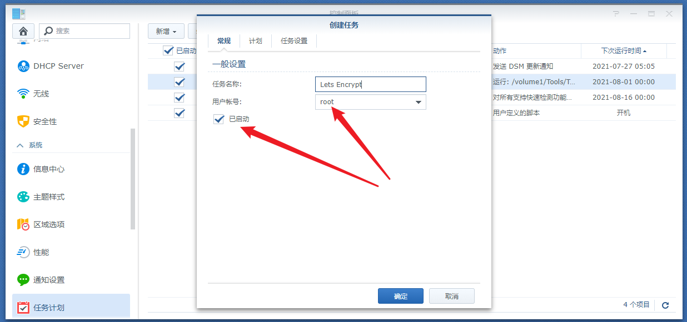
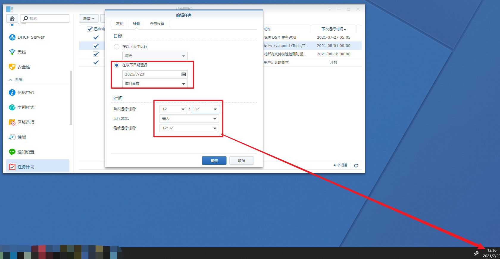
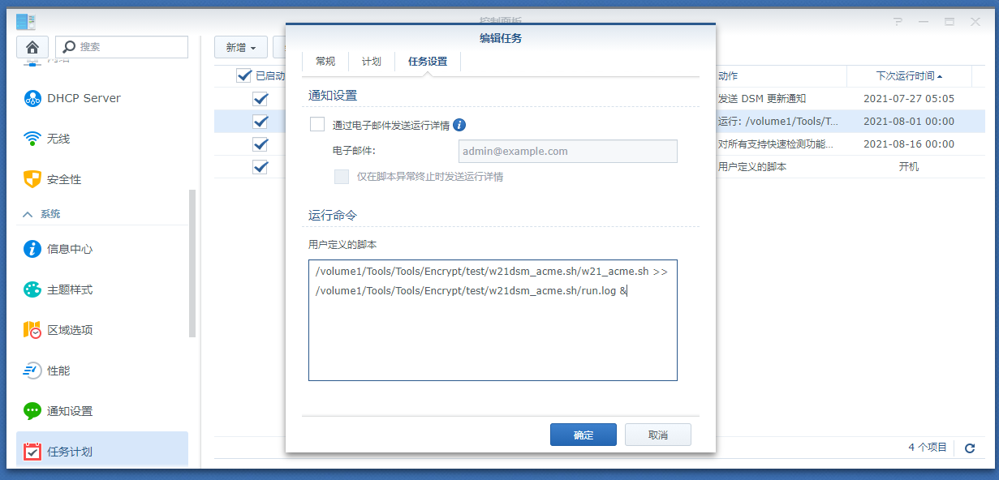
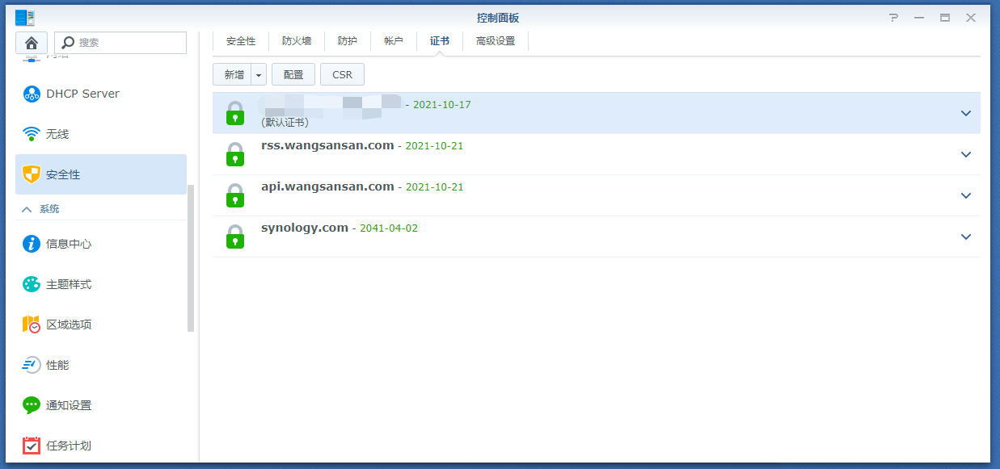

# 说明
  - 此脚本主要针对群晖系统进行 **Let's Encrypt** 证书申请，若需要在非群晖系统上使用此脚本，需要 `DSM_CERT_PATH`、`DSM_CERT_INFO` 两个初始环境变量，或者更改 `CopyFile()` 方法，以及 `ReloadNginx()` 方法。</br>
  - 此脚本基于 [acmesh-official/acme.sh - v3.0.0](https://github.com/acmesh-official/acme.sh) ，故此，在未来若新版本中的调用方法与此脚本中所调用方法不一致导致申请失效，需要适当调整此脚本调用中调用代码部分以作适配。</br>
  - 同时，[acmesh-official/acme.sh](https://github.com/acmesh-official/acme.sh)  针对不同 **ISP服务商** 提供的 **DNS变更** 的API调用实现证书申请，即表示随着 **ISP服务商** 的API变更，也会导致申请失败，此时需要对 **acme.sh** 程序进行升级，升级指令为: `acme.sh --upgrade`</br>

# 解决的问题
  如果你也因为和我遇到相同的问题导致 **Let's Encrypt** 证书申请失败，**听一句劝！别踩坑！**</br>
  **Download it! Run it!**</br>
  **Download it! Run it!**</br>
  **Download it! Run it!**</br>
  - **1、群晖自带的 Let's Encrypt 申请失败问题**</br>
  - **2、使用 acme.sh 申请过程中 idn 指令不存在的问题**</br>

# 解决问题的方法
  - **1、群晖自带的 Let's Encrypt 申请失败问题**</br>
    ~~略，详见问题2的解决办法~~
  - **2、使用 acme.sh 申请过程中 idn 指令不存在的问题**</br>
    本仓库已包含编译完成的 `idn` 可执行文件并修改 `idn` 相关环境变量以保证 `idn` 正常运行，若运行非`x86`平台，请自行下载 `idn` 源码编译，下方提供几点关键信息以供参考：
    - **libidn 官方下载地址：[GNU - IDN](https://ftp.gnu.org/gnu/libidn/)**</br>
    - **本项目所使用的版本：libidn-1.19** (**GNU社区**推荐使用**libidn2**以支持`IDNA 2008`和`TR46`，需要的同学请对应下载)
    - **本项目所编译的平台：Ubuntu 21.04 x64**</br>
    - **编译完成后需要修改：**(在**libidn-1.19**中为`第35行`的`relink_command`处)</br>
      *主要修改环境变量 `PATH` 以及 `LD_LIBRARY_PATH`*</br>
      *以下为我的修改内容，供使用其他版本时参考*</br>
      ```bash
      # 此处仅演示 libidn-1.19 版本中我所做的修改内容
      W21_LIBIDN_ROOT_PATH=$(cd "$(dirname "$0")/..";pwd)
      W21_LIBIDN_ROOT_SRC_PATH=$(cd "$(dirname "$0")";pwd)
      relink_command="(cd $W21_LIBIDN_ROOT_SRC_PATH; { test -z \"\${LIBRARY_PATH+set}\" || unset LIBRARY_PATH || { LIBRARY_PATH=; export LIBRARY_PATH; }; }; { test -z \"\${COMPILER_PATH+set}\" || unset COMPILER_PATH || { COMPILER_PATH=; export COMPILER_PATH; }; }; { test -z \"\${GCC_EXEC_PREFIX+set}\" || unset GCC_EXEC_PREFIX || { GCC_EXEC_PREFIX=; export GCC_EXEC_PREFIX; }; }; { test -z \"\${LD_RUN_PATH+set}\" || unset LD_RUN_PATH || { LD_RUN_PATH=; export LD_RUN_PATH; }; }; { test -z \"\${LD_LIBRARY_PATH+set}\" || unset LD_LIBRARY_PATH || { LD_LIBRARY_PATH=; export LD_LIBRARY_PATH; }; }; PATH=\"$PATH\"; export PATH; gcc -g -O2 -o \$progdir/\$file idn.o idn_cmd.o  ../lib/.libs/libidn.so ../gl/.libs/libgnu.a  -Wl,--rpath -Wl,$W21_LIBIDN_ROOT_PATH/lib/.libs ) "
      ```

# 可能存在的其它问题
  - **nss验证失败**</br>
    该问题在**Ubuntu**测试运行时出现，**CentOS**运行过程中未发现此问题</br>
    目前暂未发现该依赖在**群晖**中的影响，此问题主要在`curl`过程中会导致域名验证失败</br>
    **Ubuntu 的解决办法：** ```sudo apt-get install libnss-tls```</br>

# 技术关键点
  如果希望深入了解本脚本实现，了解以下几个关键信息或许能有所帮助：
  - **1、群晖系统的证书存储**</br>
    - **证书配置路径**：/usr/syno/etc/certificate/_archive</br>
    - **证书存放关系**: /usr/syno/etc/certificate/_archive/INFO</br>
  - **2、群晖中nginx的重新加载方式**</br>
    ```bash
    /usr/syno/etc/rc.sysv/nginx.sh reload
    ```
  - **3、acme.sh程序申请证书过程中所需的依赖项**</br>
    - **libidn**</br>
  - **4、其它**</br>
    - **使用脚本解析/封装 JSON，`jq` 的使用**

# 使用方法
### 1、准备工作
  - **阿里云或其它域名服务商的API调用Key**</br>
    此过程不作详细阐述，登陆阿里云后台，在右侧头像位置悬停</br>
    选择`AccessKey管理`新建子账户并保存好`AccessKey ID`以及`AccessKey Secret`</br>
    之后，给刚创建的账户添加`AliyunDNSFullAccess`授权</br>

### 2、下载
  - **Gitee 仓库：** [https://gitee.com/w0x0021/w21dsm_acme.sh/repository/archive/v1.0?format=zip](https://gitee.com/w0x0021/w21dsm_acme.sh/repository/archive/v1.0?format=zip)
  - **Github 仓库：** [https://github.com/w0x0021/w21dsm_acme.sh/archive/refs/tags/v1.0.zip](https://github.com/w0x0021/w21dsm_acme.sh/archive/refs/tags/v1.0.zip)</br>

### 3、上传文件到DSM并解压缩
  我演示所用的文件目录为：`/volume1/Tools/Tools/Encrypt/test/`</br>
  - **1、更改config配置参数**</br>
    打开`config`文件按照注释内容进行修改即可</br>
    其它域名服务的API用法参考：[acme.sh/wiki/dnsapi](https://github.com/acmesh-official/acme.sh/wiki/dnsapi)
    

  - **2、复制脚本程序绝对路径**</br>
    之后进入目录右键`w21_acme.sh`文件查看属性，复制出脚本程序的绝对路径得到：`/volume1/Tools/Tools/Encrypt/test/w21dsm_acme.sh/w21_acme.sh`
  
    
  
### 4、添加任务计划
  如果希望全过程无需登录**SSH**，在添加任务计划时，时间选择比当前时间后一分钟，可以在添加完任务一分钟后立即执行，等待执行完毕之后，即可调整时间为每月一日自动执行，或者不作修改，等下一个周期自动执行，关键点如图中步骤:</br>
  - **1、所属用户必须选择：root，同时勾选“已启动”**</br>
    
  - **2、设置当前时间的后一分钟执行**</br>
    
  - **3、运行指令，粘帖之前复制得到的脚本程序绝对路径，并添加日志输出**</br>
    - **我的运行命令：**</br>
      ```bash
      /volume1/Tools/Tools/Encrypt/test/w21dsm_acme.sh/w21_acme.sh >> /volume1/Tools/Tools/Encrypt/test/w21dsm_acme.sh/run.log &
      ```
    
### 5、查看运行日志以及证书设置
  - **1、查看运行日志**</br>
    等待时间触发任务计划，查看日志 `/volume1/Tools/Tools/Encrypt/test/w21dsm_acme.sh/run.log` (即：上传的脚本根目录下的`run.log`) 最后出现如下内容表示运行完成</br>
    ```bash
    [+] Copy certificate.
        [*] Copying: example1.domain.com
        [*] Set DSM certificate information.
        [*] Copying: example2.domain.com
        [*] Set DSM certificate information.
    [-] Copy certificate finish.
    alias-register stop/waiting
    ```
    或者可以直接登录到**SSH**，可以使用`sudo -s`切换到**root**账户运行此脚本
  - **2、控制面板查看/设置证书列表**
    

    最后到控制面板查看证书即可

------

# 联系我
**如果脚本存在Bug或者有任何疑问，欢迎邮件或留言**</br>
<li>
    
    <a target="view_window" href="https://blog.csdn.org/byb123/">CSDN - 王三三</a>
</li>
<li>
    
    <a target="view_window" href="https://www.wangsansan.com">Blog - 王三三</a>
</li>
<li>
    
    <a target="view_window" href="https://gitee.com/w0x0021">Gitee - w0x0021</a>
</li>
<li>
    
    <a target="view_window" href="https://github.com/w0x0021">Github - w0x0021</a>
</li>
<li>
    
    <a target="view_window" href="mailto:w0x0021@gmail.com">GMail - w0x0021@gmail.com</a>
</li>
